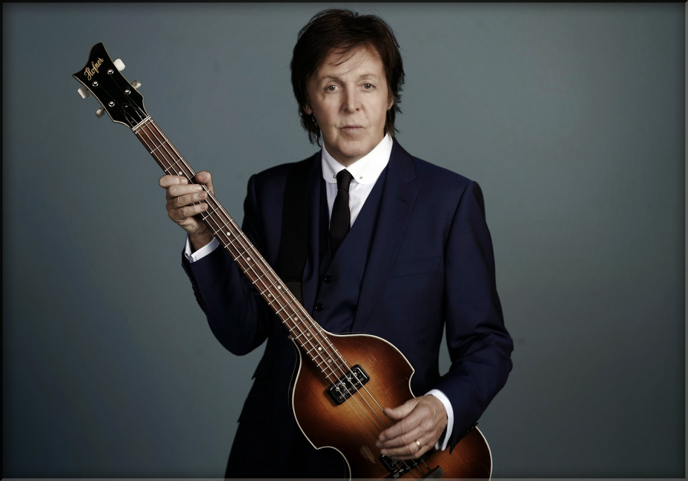

## Paul McCartney Biography

Paul McCartney (born 18 June 1942)  is an English singer/songwriter and a key member of the Beatles. After the Beatles split up in 1970, he pursued his own successful solo career, recording with a variety of artists, including his group ‘The Wings’. According to the Guinness Book of Records, he is the best selling artist of all time.

Paul McCartney was born in Liverpool, 1942, and became interested in music from an early age. As a teenager, he was a budding singer-songwriter and became good friends with John Lennon and later George Harrison – this was to prove the nucleus of the Beatles. In the early 1960s, The Beatles began by playing gigs in clubs in Germany and Liverpool. It was at the Cavern Club in Liverpool where they were spotted by manager Brian Epstein. He secured them their first major recording contract with Parlophone (after many other record companies like Decca had turned them down)

It was playing at the Cavern club than Paul and John Lennon realised most groups were just doing cover versions, this inspired them to write their own music and this was a feature of the Beatles recordings for the next ten years.

In 1963, the Beatles soon shot to international fame and became one of the most recognised names in the world, especially after there visit to the US in 1964. At the peak of their fame, the Beatles followed a punishing schedule of recording, live performances and media interviews. The music of the Beatles captivated a new generation of music lovers, but also their free spirit and innovation captured the feeling of the 1960s and sense of breaking out of old forms and traditional ideas.

In 1966, the Beatles performed their last live tour in the US. They decided to stop live performances because of the hysterical screaming and attention of fans. This encouraged them to do more private recording.

In the late 1960s, the group spent more time in the recording studio. They also became more innovative, incorporating Eastern influences and new styles into their music. In 1967, the Beatles visited a meditation retreat by the Maharishi Mahesh Yogi. McCartney said of the experience.

In the late 1960s, there was also increased tension between Paul McCartney and John Lennon. Lennon and McCartney were the two major composers and writers, but they started to drift apart. McCartney struggled with Lennon’s heavy LSD usage and also resented Yoko Ono’s presence in recording studios. However, despite the personal tension, the late years of the Beatles produced some of the most memorable music of their career. It included ground-breaking albums such as Sgt. Pepper’s Lonely Hearts Club Band, The Beatles and Abbey Road.

However, by 1970, the Beatles had split, with Lennon the keenest to pursue a new direction. The break up was difficult for McCartney who experienced a period of depression. However, his new wife, Linda encouraged him to pursue a new career path. This involved forming a new band – The Wings, which lasted until 1981. During the 1970s, the Wings had major successes. The Mull of Kintyre was the first single to sell more than two million copies.

In the early 1970s, there was some lingering friction and competitive spirit between Lennon and McCartney, though they did reconcile for a period in 1974. McCartney was devastated by Lennon’s murder in 1980 and stated he wished he could have got to know him better.

